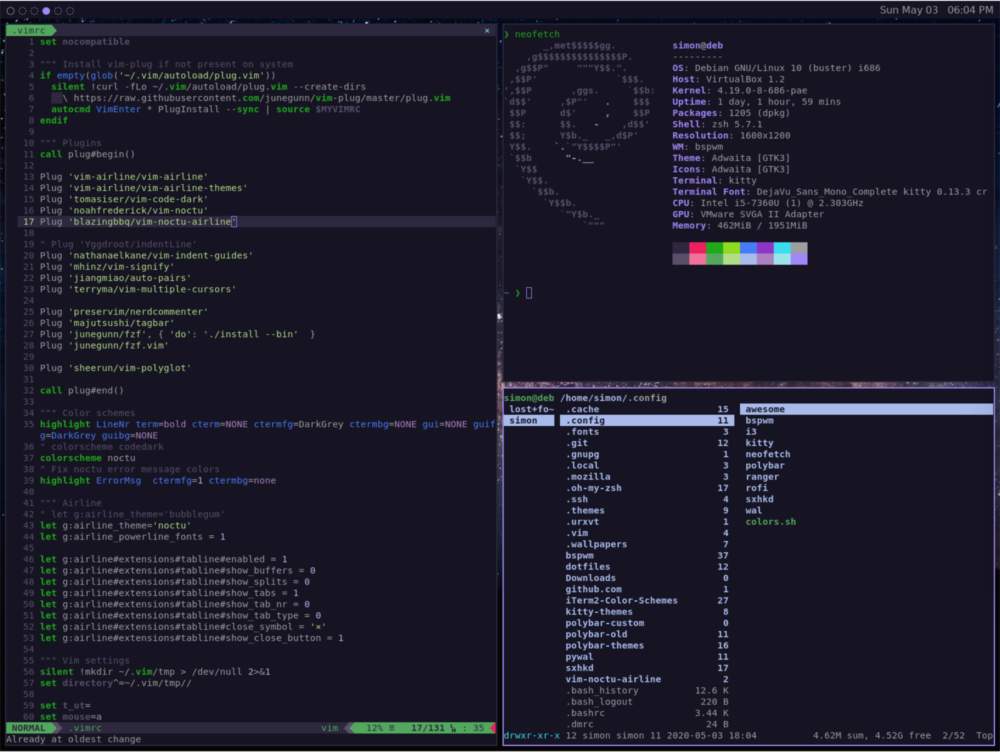
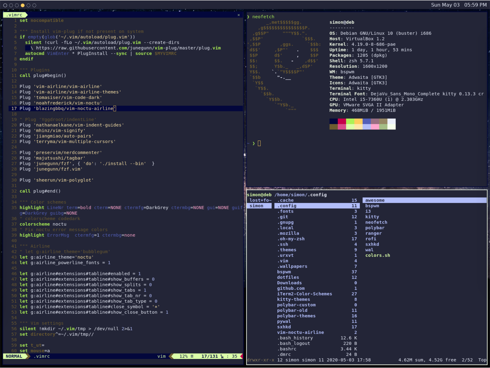
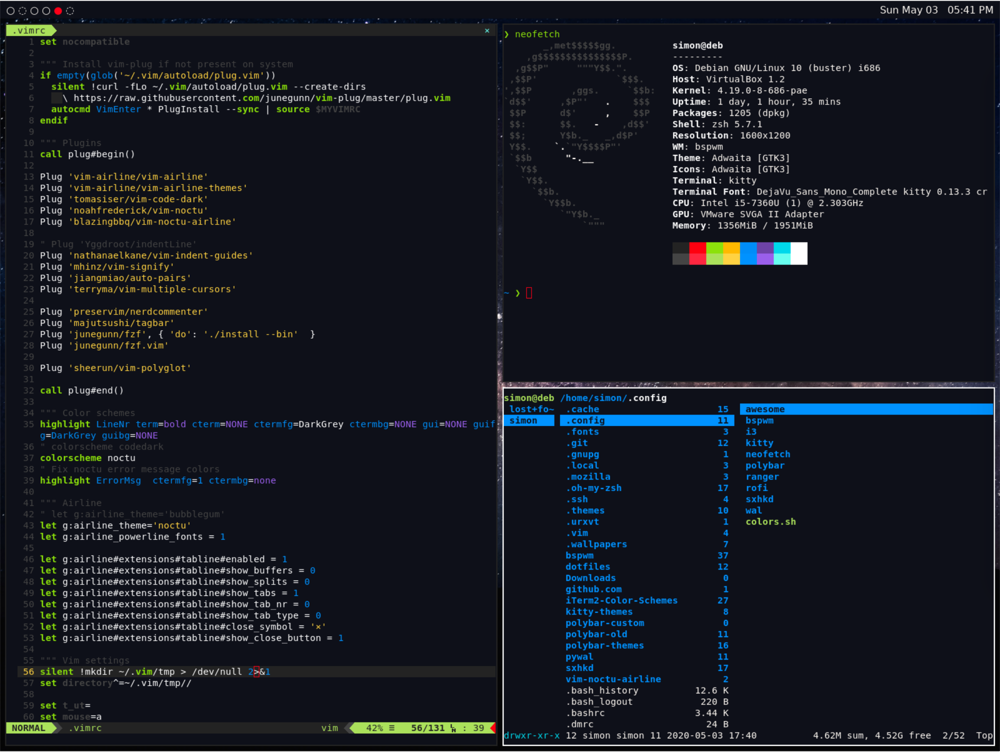
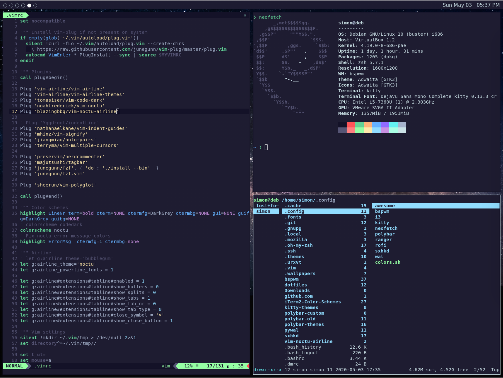
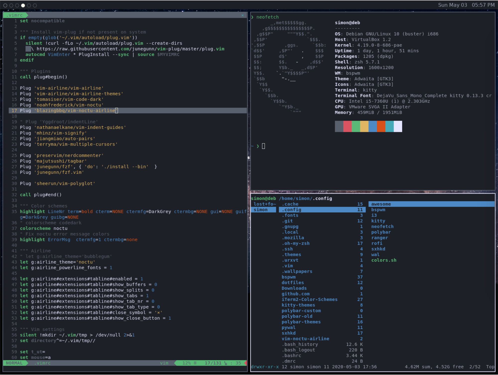
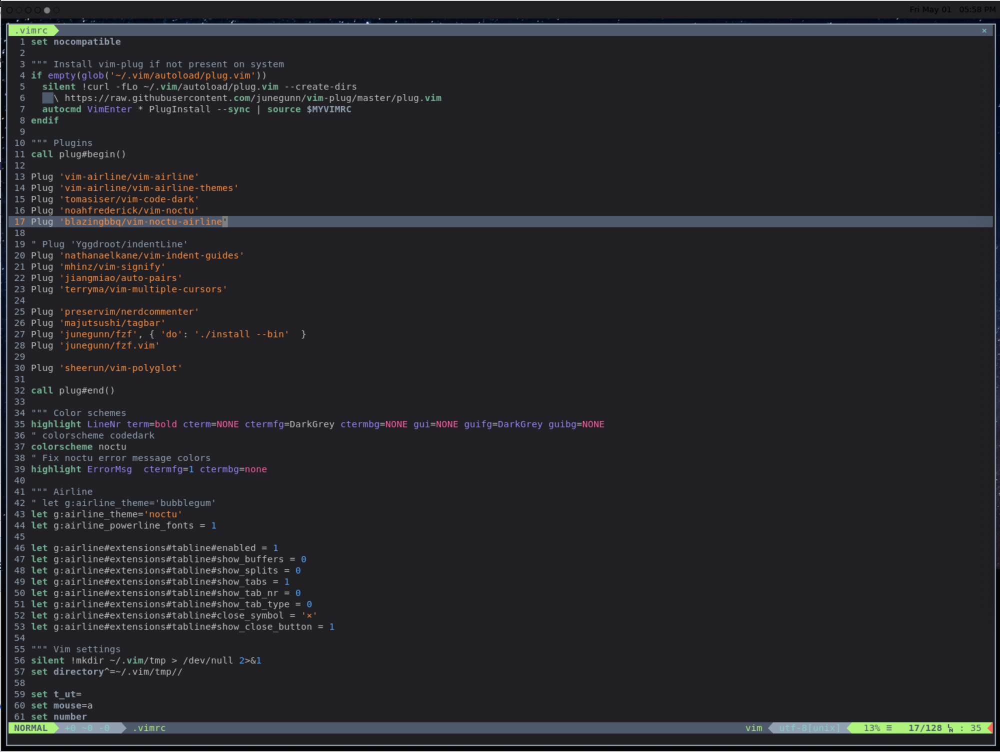
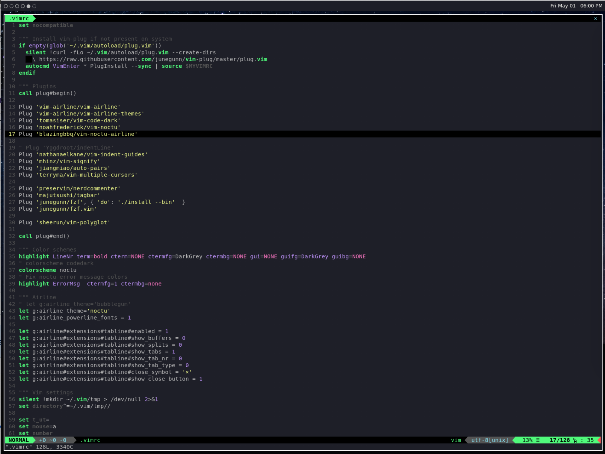

# Dotfiles

Repository containing my dotfiles.

## Overview

This setup aims to keep themes consistent across all software used. This is accomplished by synchronizing themes with the terminal's 16 ANSI colors. This makes it easy to change the theme across the entire system without needing to change every configuration.
Synchronization is done from the `colors.sh` script found in the `.config` directory. The terminal theme is set using the `theme` variable. The script will then use the theme found at `~/.themes/$theme.conf` and:

- Symlink the theme for use by kitty
- Source the colors for use by bspwm
- Create a colorscheme file for polybar
- Create a color configuration for rofi

Colors are automatically synchronized in vim using [vim-noctu](https://github.com/noahfrederick/vim-noctu) and [vim-noctu-airline](https://github.com/blazingbbq/vim-noctu-airline), to synchronize the editor and status line themes.

Made for use with [kitty terminal themes](https://github.com/dexpota/kitty-themes).

## Software Used

- Window manager: [bspwm](https://github.com/baskerville/bspwm) + [sxhkd](https://github.com/baskerville/sxhkd)
- Terminal: [kitty](https://github.com/kovidgoyal/kitty)
- Editor: vim
- Shell: zsh
- Top bar: [polybar](https://github.com/polybar/polybar)

## Gallery:

### Grape

### FishTank

### Argonaut

### ChallengerDeep

### Firewatch

### Spacedust

### Source Code X

### Dracula

## Installation

Copy all files to `$HOME` directory.
